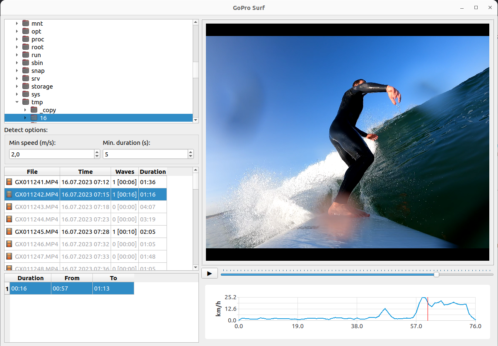

# GoProSurfSplitter

It's a GoPro video analysis tool designed to detect caught waves using GPS data in video files.



## How to build

```shell
git clone --recursive https://github.com/GoPro-Surf/GoProSurf.git
cd GoProSurf
mkdir build
cd build
cmake -DCMAKE_BUILD_TYPE=Release ..
```

## How to use

1. **Run the Application:**
   Execute the application by running the command ./GoProSurf.

2. **Select GoPro Video Directory:**
   Choose the directory where your GoPro video files are located. The application will process and analyze these files
   for you.

3. **Analyze Your Files:**
   The list of video files will be displayed below. Each file will be highlighted with one of three colors, indicating
   its status:

    * **Red:** The file does not match the format of a GoPro video.
    * **Gray:** The file does not contain any detected waves.
    * **Black:** The file contains one or more caught waves.

4. **Watch Video Footage:**
   To watch a specific video, simply click on the corresponding file in the table. The video will be played, allowing
   you to review its content.

5. **Navigate Caught Waves:**
   To identify and set positions on caught waves within the video, click on the respective row in the waves table. This
   feature allows you to precisely pinpoint the occurrences of caught waves.